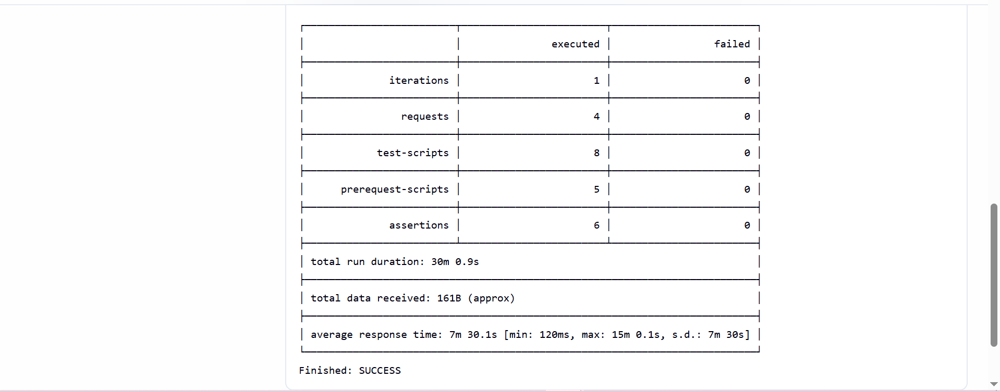
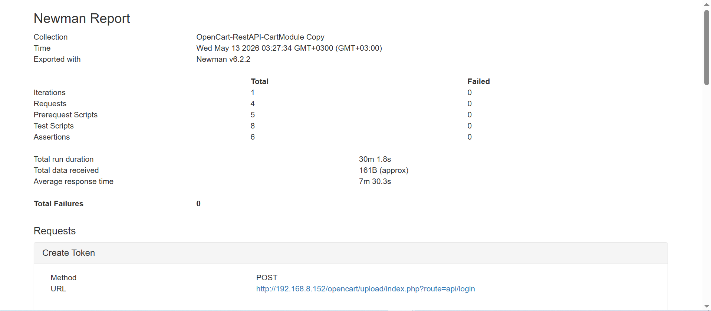
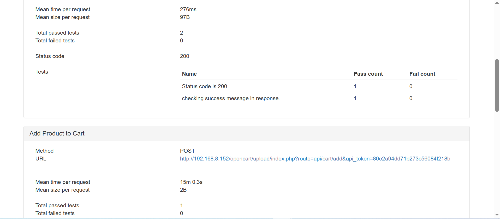
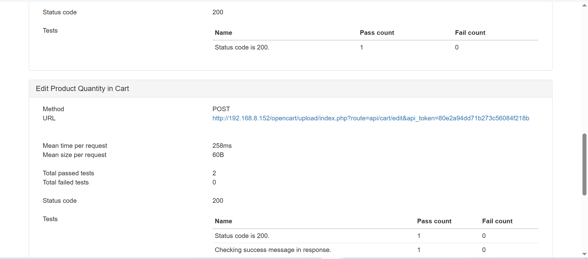
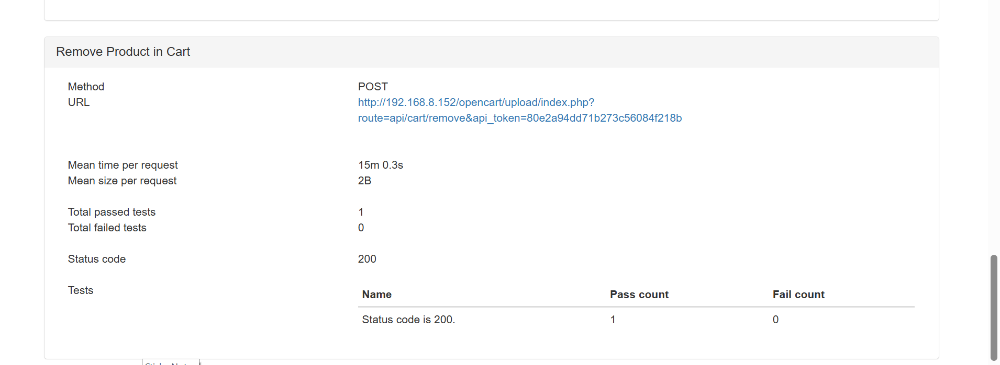

# OpenCart REST API Testing & CI/CD Automation Project

## Project Overview

This project involves API testing of the OpenCart REST API Cart Module using Postman.

The evaluation covers end-to-end cart functionalities, including authentication and cart operations such as managing products within the shopping cart.

The test suite is exported in Postman collection format and executed via Newman from the command line. Additionally, Jenkins is configured to automate test execution as part of a CI pipeline.

---

## Scope of Testing

The following API functionalities are validated:

- Creating an authentication token
- Adding products to the cart
- Viewing cart contents
- Updating product quantity in the cart
- Removing products from the cart

---

## Tech Stack

- OpenCart (E-commerce Application)
- XAMPP (Apache & MySQL)
- phpMyAdmin
- Postman
- Newman (CLI runner for Postman)
- newman-reporter-html
- Node.js
- Java 21
- Jenkins (CI/CD)

---

## System Setup

### 1. Start Local Environment
- Open XAMPP Control Panel
- Start the following services:
  - Apache
  - MySQL

Ensure both services are running before proceeding.

---

### 2. Database Setup
- Open phpMyAdmin
- Create a new database:
- Import OpenCart database structure if required
- Ensure proper configuration between OpenCart and MySQL

---

### 3. OpenCart Application
- Run OpenCart locally via Apache server
- Verify application is accessible from the browser

---

## API Testing (Postman)

- Postman is used to design and validate REST API requests
- A structured collection is created for cart module operations
- Tests include authentication and full cart lifecycle validation

---

## Automated Execution (Newman CLI)

### Run Collection:
```bash
newman run collection.json
```
console build:
!

console output:
! jenkins-console1

### Newman Execution
Below is the terminal output after running the collection:
!
!
!

### Newman HTML Report Execution
Below is the terminal output after running the collection:






